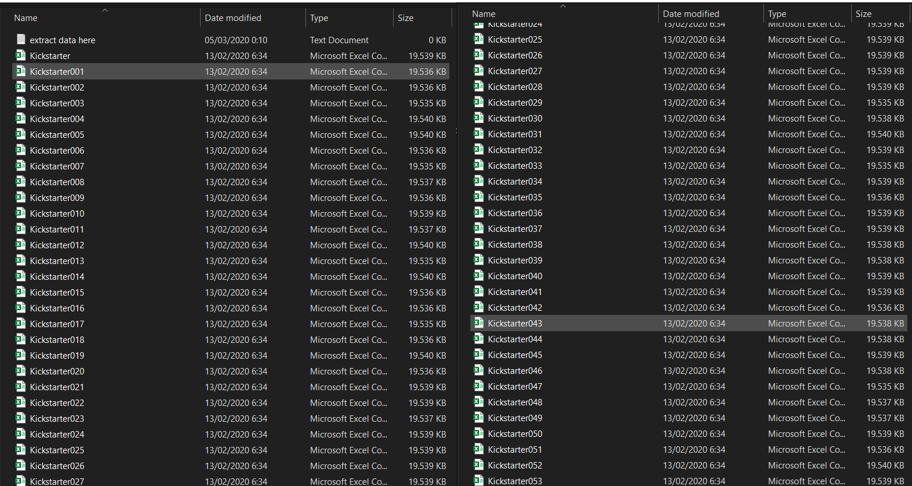

# Kickstarter Project Campaign
**Data Analysis & Visualization**

Link: https://rpubs.com/gabrielerichson/kickstarter

### Tentang Kickstarter
Kickstarter adalah sebuah online platform yang memberikan ruang pendanaan untuk proyek kreatif secara crowdfunding. Aspek yang paling penting tentang meluncurkan Project Campaign di Kickstarter yaitu jika project campaign gagal memenuhi tujuan pendanaan minimumnya, maka proyek terkait tidak akan menerima dana apa pun. Proyek yang ada di Kickstarter terdiri dari berbagai kategori antara lain Film & Video, Art, Photography, Fashion, Technology, Crafts, Music, Games, Publishing, Theater, Comics, Food, Design, Journalism dan Dance. Informasi lengkap tentang kickstarter bisa mengunjungi web https://www.kickstarter.com/ .

### Preliminary Analysis
Tujuan dari proyek ini adalah untuk menganalisa dan memvisualisasikan data kickstarter untuk mendapatkan informasi penting yang berkaitan. Dataset untuk proyek ini diambil dari repositori webroboto.io. Mereka mengembangkan scrapper robot yang mengambil semua data proyek Kickstarter secara bulanan semenjak 2009. Ada kemungkinan data proyek tidak lengkap atau terjadi duplikasi dalam dataset karena perubahan dalam pendekatan pengumpulan data oleh webroboto.io. Hal ini disampaikan oleh pihak webroboto.io pada situs web https://webrobots.io/kickstarter-datasets/ . Dataset yang dianalisis merupakan data Project Campaign di Kickstarter mulai dari 2009-2019 dengan jumlah data raw sebanyak 211.076 observasi. Setiap proyek kicstarter memiliki status failed, successful, live, suspended atau canceled. Dalam analisis ini, saya hanya tertarik pada proyek kicktarter yang memiliki status successful atau failed, sehingga saya memutuskan untuk membuang data observasi dengan status lainnya.

### Export Raw Data
Hasil download file .csv dari webroboto.io berupa zipfile, yang dimana setelah diekstrak akan mendapatkan 57 file .csv dengan total ukuran penyimpanan sebesar 1,05 GB. Seluruh data dari file .csv ini harus disatukan dahulu untuk mempermudah proses eksplorasi data. Setelah menyatukan data, saya cek kalau data kategori proyek disimpan didalam variabel category yang memiliki value berbentuk JSON values, sehingga perlu diekstrak dahulu untuk mengambil komponen variabel parent_name sebagai main_category dan name sebagai sub_category. Untuk melakukan tahapan proses tersebut, saya membuat fungsi MergeKSFiles dibawah ini. Pada RStudio, proses pembacaan data file dalam format .rds lebih cepat dibandingkan .csv dan ukuran penyimpanan datanya juga lebih kecil. Fungsi MergeKSFiles akan mengekspor hasil merge menjadi bentuk format file .rds.

**Raw Data (Data hasil download)** 
Supaya project ini dapat dengan mudah diupload dan didownload pada github, maka raw data tidak saya upload ke github, namun bisa didownload dan diextract melalui link  https://s3.amazonaws.com/weruns/forfun/Kickstarter/Kickstarter_2020-02-13T03_20_04_893Z.zip . Hasil extract download akan berbentuk kumpulan data .csv seperti berikut:

