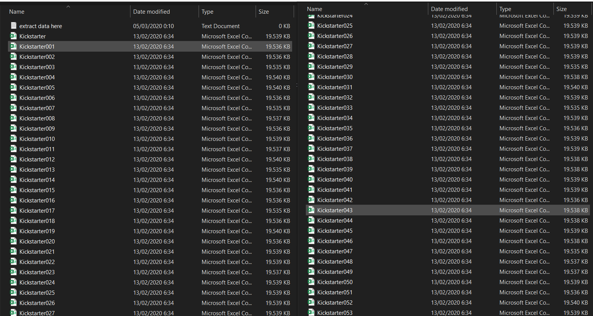

Github: https://github.com/gabrielerichsonmrp/gehm_kickstarter
<br>
```{r setup, include=FALSE, echo=FALSE}
knitr::opts_chunk$set(
  echo = TRUE,
  result="hide",
  message = FALSE,
  warning = FALSE,
  fig.align = "center",
  comment = "#>"
)

options(scipen = 9999999)
library(lubridate)
library(countrycode)
library(scales)
library(tidyverse)
library(ggplot2)
library(ggthemes)
library(paletti)
library(jsonlite)
library(gridExtra)
library(grid)
library(GGally)


# WARNA
mycolor = c(
  dark_blue="#003f5c", 
  light_blue="#2f4b7c", 
  light_purple ="#665191",
  dark_pink="#a05195", 
  light_pink="#d45087", 
  light_red="#f95d6a", 
  dark_orange="#ff6347",
  light_orange="#ff7c43",
  semi_orange="#e79658",
  orange="#dda15a",
  cream="#b59378",
  dark_cream="#A57F5F",
  choc="#85664B",
  dark_choc="#6b5340"
)

mycolorfill = c(
  
  light_blue="#2f4b7c", 
  light_purple ="#665191",
  dark_pink="#a05195", 
  light_pink="#d45087", 
  light_red="#f95d6a", 
  dark_orange="#ff6347",
  
  semi_orange="#e79658",
  orange="#dda15a",
  cream="#b59378",
  dark_cream="#A57F5F",
  choc="#85664B",
  dark_choc="#6b5340",
  light_orange="#ff7c43"
)


viz_palette(mycolor)
mycolor_fill  <- get_scale_fill(get_pal(mycolorfill))
mycolor_color <- get_scale_color(get_pal(mycolor))
mycolor_hex <- get_hex(mycolor)

```


# Intro


## Tentang Kickstarter

Kickstarter adalah sebuah online platform yang memberikan ruang pendanaan untuk proyek kreatif secara crowdfunding. Aspek yang paling penting tentang meluncurkan Project Campaign di Kickstarter yaitu jika project campaign gagal memenuhi tujuan pendanaan minimumnya, maka proyek terkait tidak akan menerima dana apa pun. Proyek yang ada di Kickstarter terdiri dari berbagai kategori antara lain **Film & Video**, **Art**, **Photography**, **Fashion**, **Technology**,   **Crafts**, **Music**, **Games**, **Publishing**, **Theater**, **Comics**, **Food**, **Design**, **Journalism** dan **Dance**. Informasi lengkap tentang kickstarter bisa mengunjungi web https://www.kickstarter.com/ . 
<br/>

## Preliminary Analysis

Tujuan dari proyek ini adalah untuk menganalisa dan memvisualisasikan data kickstarter untuk mendapatkan informasi penting yang berkaitan. Dataset untuk proyek ini diambil dari repositori [webroboto.io](https://webrobots.io/). Mereka mengembangkan scrapper robot yang mengambil semua data proyek Kickstarter secara bulanan semenjak 2009. Ada kemungkinan data proyek tidak lengkap atau terjadi duplikasi dalam dataset karena perubahan dalam pendekatan pengumpulan data oleh webroboto.io. Hal ini disampaikan oleh pihak [webroboto.io](https://webrobots.io/) pada situs web https://webrobots.io/kickstarter-datasets/ . Dataset yang dianalisis merupakan data Project Campaign di Kickstarter mulai dari 2009-2019 dengan jumlah data raw sebanyak 211.076 observasi. Setiap proyek kicstarter memiliki status *failed*, *successful*, *live*, *suspended* atau *canceled*. Dalam analisis ini, saya hanya tertarik pada proyek kicktarter yang memiliki status *successful* atau *failed*, sehingga saya memutuskan untuk membuang data observasi dengan status lainnya.<br/><br/>


# Data Preparation
## Export Raw Data
Hasil download file .csv dari webroboto.io berupa zipfile, yang dimana setelah diekstrak akan mendapatkan **57 file .csv** dengan total ukuran penyimpanan sebesar **1,05 GB**. Seluruh data dari file .csv ini harus disatukan dahulu untuk mempermudah proses eksplorasi data. Setelah menyatukan data, saya cek kalau data kategori proyek disimpan didalam variabel `category` yang memiliki value berbentuk JSON values, sehingga perlu diekstrak dahulu untuk mengambil komponen variabel `parent_name` sebagai main_category dan `name` sebagai sub_category. Untuk melakukan tahapan proses tersebut, saya membuat fungsi **MergeKSFiles** dibawah ini. Pada RStudio, proses pembacaan data file dalam format .rds lebih cepat dibandingkan .csv dan ukuran penyimpanan datanya juga lebih kecil. Fungsi **MergeKSFiles** akan mengekspor hasil merge menjadi bentuk format file **.rds**. <br>

```{r}
# Fungsi ini hanya dapat digunakan untuk kumpulan data csv kickstarter yang di download dari webroboto.io.
# Estimasi running time 6-10 menit untuk 57 csv files dengan total 200.000 baris data.
# Hasil dari fungsi ini berbentuk file .rds.
# Silahkan dimodifikasi sesuai kebutuhan sebelum menggunakan.

MergeKSFiles <- function(){
  # get dan set direktori
  wd <-  as.character(getwd())
  setwd(paste(wd,"/data_download",sep = ""))
  
  # menyimpan seluruh file *csv menjadi list
  dir <- list.files(pattern = "*.csv")
  myfiles <- lapply(dir,read_csv)
  
  # merge seluruh data dan menyimpan dalam variabel ks_raw
  ks_raw <- myfiles %>% bind_rows(.id = "filename")
  
  # ekstrak data main_category dan sub_category DARI JSON Value
  # jalankan library plyr sebelum menjalankan library dplyr
  category_raw <- map(as.character(ks_raw$category),fromJSON)
  category_raw <- plyr::ldply(category_raw, data.frame)
  category_raw <- category_raw[,c("parent_name","name")]
  colnames(category_raw) = c("main_category","sub_category")
  ks_raw <- cbind(category_raw,ks_raw)
  
  # Remove variabel yang tidak dibutuhkan
  ks_raw <- ks_raw %>% 
    select(-c(blurb,friends,is_backing,is_starrable,is_starred,location,permissions,photo,source_url,spotlight,urls,profile, creator,currency_trailing_code,disable_communication,id,slug,staff_pick,state_changed_at,usd_type,currency_symbol,currency,current_currency,category))
  
  # Seleksi data dibawah tahun 2020
  ks_raw$launched_at =  as.Date(as.POSIXlt.POSIXct(ks_raw$launched_at))
  ks_raw$deadline = as.Date(as.POSIXlt.POSIXct(ks_raw$deadline))
  ks_raw <- ks_raw[year(ks_raw$launched_at) <2020,]
  ks_raw <- ks_raw[year(ks_raw$deadline) <2020,]
  
  # Export RDS file dan simpan dengan nama kick_raw.rds
  saveRDS(object=ks_raw, file=paste(paste(wd,"/data_input/",sep = ""),"ks_input.rds",sep=""))
  
}

# jalankan fungsi ini untuk merge dan ekstrak data category
# MergeKSFiles()

```


**Raw Data (Data hasil download)**<br>
Supaya project ini dapat dengan mudah diupload dan didownload pada github, maka raw data tidak saya upload ke github, namun bisa didownload dan diextract melalui link  https://s3.amazonaws.com/weruns/forfun/Kickstarter/Kickstarter_2020-02-13T03_20_04_893Z.zip . Hasil extract download akan berbentuk kumpulan data .csv seperti berikut:




## Read Data

Setelah sukses mengekspor data raw menjadi .rds menggnukan fungsi **MergeKSFiles()**, total data yang didapat sebanyak 205,510 observasi dan 17 variabel dengan ukuran penyimpanan data sebesar **10.5 MB**. Ukuran penyimpanan datanya sangat signifikan berkurang sehingga dapat mempercepat performance pengelolaan data.
```{r}
ks_input <- readRDS("data_input/ks_input.rds")
glimpse(ks_input)
```


# Data Pre-Processing
## Data Cleansing
### Validasi dan Seleksi Variabel
Jika dilihat pada struktur data **ks_input**, variabel yang ada cukup banyak namun tidak semua variabel tersebut akan gunakan. Selain itu  tipe data dari masing-masing variabel juga belum sesuai dengan kebutuhan, sehingga perlu perlu dilakukan Konversi data type dan menyeleksi variabel yang diunakan sesuai kebutuhan analisa kali ini saja. Oleh karena itu perlu dilakukan tahap berikut:<br>
  1. Validasi seluruh data type<br>
  2. Konversi format tanggal *created_at*, *deadline*, *launched_at*<br>
  3. Mendapatkan data total hari project campaign: **total days = launched date - created at** <br>
  4. Mendapatkan data goal project dalam satuan USD: **usd goal = goal**  *  **static usd rate** <br>
  6. Seleksi variabel yang dibutuhkan: *project_name*, *main_category*, *sub_category*, *country_code*, *country_name*, *year_created*, *created_at*, *launched_at*, *deadline*, *total_days*, *usd_goal*, *backers_count*, *static_usd_rate*, *usd_pledged,state* <br>
  7. Seleksi data degan status **successful** dan **failed**<br>
  8. Mengkonversi data *project_name* menjadi lower case (untuk validasi data unik) <br>
  
```{r}
# Konversi Data Type
ks_input$main_category = as.factor(ks_input$main_category)
ks_input$sub_category = as.factor(ks_input$sub_category)
ks_input$converted_pledged_amount = as.integer(ks_input$converted_pledged_amount)
ks_input$country_code = as.factor(countrycode::countrycode(ks_input$country,"iso2c","iso3c"))
ks_input$country_name = as.factor(ks_input$country_displayable_name)
ks_input$fx_rate = as.numeric(ks_input$fx_rate)
ks_input$goal = as.numeric(ks_input$goal)
ks_input$created_at = as.Date(as.POSIXlt.POSIXct(ks_input$created_at))
ks_input$total_days = as.integer(ks_input$deadline-ks_input$launched_at)
ks_input$project_name = as.character(ks_input$name)
ks_input$project_name = stringr::str_to_lower(ks_input$project_name)
ks_input$pledged = as.numeric(ks_input$pledged)
ks_input$state = as.factor(ks_input$state)
ks_input$static_usd_rate = as.numeric(ks_input$static_usd_rate)
ks_input$usd_goal = ks_input$goal*ks_input$static_usd_rate
ks_input$usd_pledged = as.numeric(ks_input$usd_pledged)
ks_input$main_category <- droplevels(ks_input$main_category)
ks_input$sub_category <- droplevels(ks_input$sub_category)
ks_input$country_code <- droplevels(ks_input$country_code)
ks_input$country_name <- droplevels(ks_input$country_name)

# seleksi project campaign dengan status successful atau failed
ks_input <- ks_input[ks_input$state %in% c('successful','failed'),]
ks_input$state <- droplevels(ks_input$state)

# seleski hanya variabel yang digunakan saja
ks_input <- ks_input[,c("project_name","main_category","sub_category","country_code","country_name","created_at","launched_at","deadline","total_days","usd_goal","backers_count","usd_pledged","state")]

glimpse(ks_input)
```

Setelah dilakukan konversi dan seleksi data, dataset yang dimiliki tersisa **191,210 observasi dan 13 variabel**.


### Missing Value
```{r}
colSums(is.na(ks_input))
```

Jika dilihat data main_category memiliki *6950* Missing values. Mari mengexplore data yang memilki missing value.

**Eksplorasi Missing Value**
```{r}
ks_input[is.na(ks_input$main_category),]
```

jika dicek pada data yang memiliki missing value, data sub_category seharusnya merupakan data main_category dan yang memiliki missing value seharusnya data sub_category. Berikut data main_category:

```{r}
# Data main_category
levels(ks_input$main_category)
```

Maka solusinya yaitu subtitusi value **main_category = sub_category** dan **sub_category = NAValue** untuk data yang memiliki **main_category=NA Values**. Dengan begini, sub_category akan memiliki NA Values.

```{r}
#Data unik dari sub_category yang memiliki missing value main_category

ks_input$main_category <- ifelse(is.na(ks_input$main_category),as.character(ks_input$sub_category), as.character(ks_input$main_category))
ks_input$sub_category <- ifelse(ks_input$main_category==ks_input$sub_category,NA, as.character(ks_input$sub_category))

ks_input$main_category <-  as.factor(ks_input$main_category)
ks_input$sub_category <-  as.factor(ks_input$sub_category)

# Missing Value
colSums(is.na(ks_input))
dim(ks_input)
```

Setelah dilakukan subtitusi, variabel yang memilki missing values menjadi sub_category sebanyak **6950 observasi**.


### Duplikat Value
```{r}
data.frame(cbind("Total Data Seluruhnya"=dim(ks_input)[1], "Total Data Unik"=dim(unique(ks_input))[1]))
```

Berdasarkan jumlah diatas, total observasi yang dimiliki sebanyak **191,210** namun total data yang unik sebanyak **170,124**. Hal ini membuktikan bahwa dataset ini memiliki data yang duplikat, sehingga data duplikat perlu dibuang.

```{r}
#Remove data duplikat
ks_input <- unique(ks_input) 
data.frame(cbind("Total Data Seluruhnya"=dim(ks_input)[1], "Total Data Unik"=dim(unique(ks_input))[1]))
```

Setelah data duplikat dibuang, total data observasi yang dimiliki sebanyak **170,124**.


## Data Inspection
Setelah melakukan proses cleansing data, total observasi atas dataset Kickstarter Campaign yang dimiliki sebanyak **170,124** dan **13 variabel**. Namun, data yang tidak memiliki sub category sebanyak **6,950** atau **4,1%**.

### 100 Data Teratas
```{r}
head(ks_input,100)
```

### 100 Data Terbawah
```{r}
tail(ks_input,100)
```

<br>

### Deskripsi Variabel

<table class="table table-condensed">
  <tr>
    <th>Variabel</th>
    <th>Deskripsi Informasi</th>
  </tr>
  <tr>
    <td>project_name</td>
    <td>Nama dari setiap project</td>
  </tr>
   <tr>
    <td>main_category</td>
    <td>Kategori Project</td>
  </tr>
   <tr>
    <td>sub_category</td>
    <td>Sub Kategori dari project</td>
  </tr>
   <tr>
    <td>country_code</td>
    <td>Kode Negara dimana project dibuat</td>
  </tr>
   <tr>
    <td>country_name</td>
    <td>Nama Negara dimana project dibuat</td>
  </tr>
   <tr>
    <td>created_at</td>
    <td>Tanggal Project Campaign dibuat pada masing-masing project</td>
  </tr>
   <tr>
    <td>launched_at</td>
    <td>Tanggal Project Campaign launch atau dimulai pada masing-masing project</td>
  </tr>
  <tr>
    <td>deadline</td>
    <td>Tanggal Project Campaign berakhir pada masing-masing project</td>
  </tr>
  <tr>
    <td>total_days</td>
    <td>Total hari campaign atau total hari setiap project berhak mendapatkan pendanaan</tr>
  </tr>
  <tr>
    <td>usd_goal</td>
    <td>Target pendanaan minimun dalam satuan USD.</td>
  </tr>
  <tr>
    <td>backers_count</td>
    <td>Jumlah pemberi dana</td>
  </tr>
  <tr>
    <td>usd_pledged</td>
    <td>Total pendapatan pendanaan yang didapatkan selama campaign berlangsung dalam satuan USD</td>
  </tr>
  <tr>
    <td>state</td>
    <td>Status campaign. Status dikatakan sukses apabila total pendapatan pendanaan lebih >= target pendanaan minimum</td>
  </tr>
</table>

<br>

### Export Data Clean
Setelah data diolah sesuai kebutuhan analisis ini, maka clean data saya export dan diimport kembali dengan nama *ks_clean*. Ukuran data ks_clean setelah diexport turun sangat signifikan menjadi **6,6 MB**. 

```{r}
#Export Data Clean
wd <-  as.character(getwd())
saveRDS(object=ks_input, file=paste(paste(wd,"/data_clean/",sep = ""),"ks_clean.rds",sep=""))
ks_clean <- readRDS("data_clean/ks_clean.rds")
```


# Data Analysis
## Bagaimana pertumbuhan Project Campaign dari 2009-2019?
```{r}
total.project <- data.frame(table(year(ks_clean$launched_at)))

ggplot(total.project,aes(x=Var1, y=Freq, fill=Freq))+
geom_bar(stat = "identity", position = "dodge",width = 0.9, show.legend = FALSE)+
geom_text(aes(label=Freq, y=Freq+500), vjust = -0.5, size=3) +
labs(
  title = "Total of Project Campaign (2009-2019)",
  x="Year",
  y="Total of Project Campaign"
)+
theme_minimal()+
 theme(
      axis.title=element_text(size=9, face="bold"),
      axis.text.x=element_text(size=9,margin = margin(b=10)),
      axis.text.y.left = element_text(margin = margin(l=10))
      ) +
scale_fill_gradient(low=mycolor_hex("light_blue"), high=mycolor_hex("light_orange"))

```


Berdasarkan chart di atas, jumlah proyek di kickstarter selalu meningkat dari tahun 2009-2015, kemudian jumlah proyek menurun hingga tahun 2018 dan meningkat kembali ditahun 2019. Dari tahun 2009-2019, jumlah proyek di Kickstarter paling banyak pada tahun 2015 dengan jumlah 32,236 proyek. Lantas proyek kategori apa yang paling banyak? dan bagaimana pendanaannya?

```{r, fig.width = 9}
ks_2015 <- ks_clean[year(ks_clean$launched_at)=="2015",]
project.popular.2015 <- data.frame(table(ks_2015$main_category))
colnames(project.popular.2015) <- c("main_category","freq")
project.popular.2015$main_category <- as.factor(project.popular.2015$main_category)
project.popular.2015$main_category <- reorder(project.popular.2015$main_category,project.popular.2015$freq)

ggplot(project.popular.2015,aes(x=main_category,y=freq,fill=freq))+
geom_bar(stat = "identity", position = "dodge",width = 0.9, show.legend = FALSE)+
geom_text(aes(label=freq, y=freq+400), size=3) +
labs(
  title="Most Project Campaign in 2015",
  x = "Project Category",
  y = "Total Project"
)+
coord_flip()+
theme_minimal()+
theme(
      axis.title=element_text(size=9, face="bold"),
      axis.text.x=element_text(size=9,margin = margin(b=10)),
      axis.text.y.left = element_text(margin = margin(l=10))
      ) + 
scale_fill_gradient(low=mycolor_hex("light_blue"), high=mycolor_hex("light_orange"))  -> p1


# Most Pledged 2015
most.pledged.2015 <- aggregate(usd_pledged~main_category,ks_2015,sum)
most.pledged.2015$main_category <- reorder(most.pledged.2015$main_category,most.pledged.2015$usd_pledged)

ggplot(most.pledged.2015, aes(x=main_category,y=usd_pledged/1000000,fill=usd_pledged))+
geom_bar(stat = "identity",show.legend = FALSE)+
geom_text(aes(label=paste0("$",round(usd_pledged/1000000,1)),y=round(usd_pledged/1000000,1)+10), size=3)+
labs(
  title ="Most Pledged Project in 2015",
  x = NULL,
  y = "Amount Pledged (USD millions)"
)+
coord_flip()+
theme_minimal()+
theme(
      axis.title=element_text(size=9,face="bold"), 
      axis.text.x=element_text(size=9,margin = margin(b=10))
) + 
scale_fill_gradient(low=mycolor_hex("light_blue"), high=mycolor_hex("light_orange"))->p2


grid.arrange(p1, p2, ncol = 2)

```

Pada tahun 2015, Jumlah Proyek Film & Video paling banyak didaftarkan untuk mengikuti project campaign di Kickstarter, namun total pendanaan proyek Technology paling besar. Proyek Technology mendapatkan total pendanaan USD 121 Juta sedangkan proyek Film & Video mendapatkan USD 51 juta. 


***

<br>

## Bagaimana pertumbuhan pendanaan dari tahun 2009-2020?
```{r}
total.pledged <- aggregate(ks_clean$usd_pledged~year(ks_clean$launched_at),data=ks_clean, sum)
colnames(total.pledged) <- c("year","total_pledged")

ggplot(total.pledged, aes(x=as.factor(year), y=total_pledged/1000000, fill=total_pledged))+
geom_bar(stat = "identity", position = "dodge",width = 0.9, show.legend = FALSE)+
 geom_text(aes(label=paste0("$",round(total_pledged/1000000,1)),y=round(total_pledged/1000000,1)+10), vjust=-0.5, size=3.5)+
labs(
  title = "Total Pledged Amount (2009-2019)",
  x="Year",
  y="Total Pledged Amount (USD Millions)"
)+
theme_minimal()+
theme(
      axis.title=element_text(size=9, face="bold"),
      axis.text.x=element_text(size=9,margin = margin(b=10)),
      axis.text.y.left = element_text(margin = margin(l=10))
  ) + 
scale_fill_gradient(low=mycolor_hex("light_blue"), high=mycolor_hex("light_orange"))

```


Total pendanaan di kickstarter selalu meningkat dari tahun 2009-2015, kemudian total pendanaan menurun hingga tahun 2018 dan meningkat kembali ditahun 2019. Jika dilihat dari polanya, peningkatan dan penurunan total pendanaan proyek di kicktarter sesuai dengan pola peningkatan dan penurunan jumlah proyek di kickstarter pada poin 4.1. Namun, yang aneh jumlah proyek di kickstarter paling banyak pada tahun 2015, tapi mengapa total pendanaan paling banyak terjadi pada tahun 2019? 


```{r, fig.asp=0.4,  fig.width = 9}

ks_pledged <- ks_clean[year(ks_clean$launched_at) %in% c("2019","2015"),]
ks_pledged <- ks_pledged[ks_pledged$usd_pledged>0,]


ggplot(ks_pledged, aes(as.factor(year(launched_at)), log(usd_pledged), fill=as.factor(year(launched_at)))) + 
  geom_boxplot(show.legend = FALSE) +
  
  labs(
    title ="Log of Pledged Amount: 2015 vs 2019",
    y = "Log(Pledged Amount)",
    x = "Year"
  )+
  theme_minimal()+
  theme(
      axis.title=element_text(size=8,face="bold"), 
      axis.text.x=element_text(size=10,margin = margin(b=10)),
      axis.text.y=element_text(size=10),
      axis.text.y.left = element_text(margin = margin(l=10))
      )+
  mycolor_fill()+
  coord_flip()->ks_pledged2

ks_pledged_color <- get_scale_color(get_pal(mycolorfill))
ggplot(ks_pledged, aes(backers_count,usd_pledged), group=as.factor(year(launched_at))) +
  geom_point(aes(color=as.factor(year(launched_at)),size=usd_pledged), alpha=0.6, show.legend = FALSE)+
  scale_y_continuous(name = "Amount Pledged (USD millions)",
                     labels = dollar
                          ) +
  labs(
    title ="Pledged Amount: 2015 vs 2019",
    y = "Amount Pledged",
    x = "Total Backer",
    color="Year",
    size=NULL
  )+
  guides(size = FALSE)+
 theme_minimal()+
  theme(
      axis.title=element_text(size=8,face="bold"), 
      axis.text.x=element_text(size=10,margin = margin(b=10)),
      axis.text.y=element_text(size=10),
      axis.text.y.left = element_text(margin = margin(l=10)),
      legend.position = NULL
      )+
  ks_pledged_color()->ks_pledged1


grid.arrange(ks_pledged2,ks_pledged1, ncol = 2)

```

Dapat dilihat pada boxplot bahwa rata-rata pendanaan di tahun 2019 lebih besar dari tahun 2015 dan nilai Q3 tahun 2019 lebih besar dari Q3 tahun 2015. Secara distribusi penyebarannya, terdapat beberapa proyek di tahun 2019 yang mendapatkan pendanaan jauh lebih tinggi dari pada pendanaan di tahun 2015. Hal ini menjelaskan mengapa total pendanaan di tahun 2019 lebih tinggi daripada tahun 2015.


***

<br>


## Apa kategori proyek yang paling popular dari 2009-2019?
```{r}
project.popular <- data.frame(table(ks_clean$main_category))
colnames(project.popular) <- c("main_category","freq")
project.popular$main_category <- as.factor(project.popular$main_category)
project.popular$main_category <- reorder(project.popular$main_category,project.popular$freq)

ggplot(project.popular,aes(x=main_category,y=freq,fill=freq))+
geom_bar(stat = "identity", position = "dodge",width = 0.9, show.legend = FALSE)+
geom_text(aes(label=freq, y=freq+1000), size=3) +
labs(
  title="Most Popular Project by Category (2009-2019)",
  x = "Project Category",
  y = "Total Project"
)+
coord_flip()+
theme_minimal()+
theme(
      axis.title=element_text(size=9, face="bold"),
      axis.text.x=element_text(size=9,margin = margin(b=10)),
      axis.text.y.left = element_text(margin = margin(l=10))
      ) + 
scale_fill_gradient(low=mycolor_hex("light_blue"), high=mycolor_hex("light_orange"))


```

Seperti yang kita ketahui, pertumbuhan teknologi dari tahun 2009-2019 sangat pesat dan terasa diberbagai kalangan masyarakat. Namun, berdasarkan data kickstarter yaitu proyek yang paling banyak dari tahun 2009-2019 adalah Proyek Music dengan jumlah 25100 proyek, sedangkan proyek teknologi berada pada urutan ke 4(empat) dengan jumlah 18099 proyek. Berdasarkan data ini, saya berasumsi bahwa cukup banyak proyek teknologi yang tidak mencari pendanaan melalui kickstarter. 

***

<br>

## Bagaimana pertumbuhan jumlah project campaign setiap kategori dari 2009 - 2019? {.tabset .tabset-fade .tabset-pills}

### All
```{r}
category.growth <- data.frame(table(ks_clean$main_category,year(ks_clean$launched_at)))
colnames(category.growth) <- c("main_category","year","freq")

ggplot(category.growth, aes(year, freq,group = main_category)) +
geom_line(aes(color=main_category),size=0.65)+
geom_point(aes(color=main_category))+
labs(
  title ="Growth of Project Campaign by Category (2009-2019)",
  x = "Year",
  y = "total",
  color = "Project Category"
)+
 theme_minimal()+
theme( 
      axis.title=element_text(size=9, face="bold"),
      axis.text.x=element_text(size=9,margin = margin(b=10)),
      axis.text.y.left = element_text(margin = margin(l=10))
      ) +
mycolor_color()

```

Jumlah sebagian besar proyek selalu meningkat dari tahun 2009-2015 dan memiliki puncak pertumbuhan pada tahun 2015. Namun berebeda dengan proyek Dance yang mengalami penurunan pertumbuhan pada 2015 bahkan hingga 2019. Hal ini mendukung analisa pada poin 4.1 yang dimana jumlah proyek pada tahun 2015 paling tinggi. Proyek Film & Video merajai tahun 2015 namun jumlahnya terus menurun hingga 2019 dan pada tahun 2019 dirajai oleh Proyek Games yang meningkat secara signifikan dari tahun 2018.


### Detail

```{r, eval=T, fig.asp=1.0, fig.width = 8}

ggplot(category.growth, aes(year, freq,group = main_category)) +
  geom_line(aes(color=main_category),size=0.65, show.legend = FALSE)+
  geom_point(aes(color=main_category), show.legend = FALSE)+
  labs(
    title ="Growth of Project Campaign by Category (2009-2019)",
    x = "Year",
    y = "total",
    color = "Project Category"
  )+
  facet_wrap(~main_category, scales = "free_y", ncol = 3)+
  theme_minimal()+
  theme( 
        axis.title=element_text(size=9, face="bold"),
        axis.text.x=element_text(size=9,margin = margin(b=10), angle=90),
        axis.text.y.left = element_text(margin = margin(l=10))
        ) +
  mycolor_color()

```


Berdasarkan detail dari chart pertumbuhan jumlah proyek di kickstarter, meskipun jumlah proyek Comics bukan yang paling tinggi, tapi hanya jumlah proyek Comics yang terus mengalami peningkatan dari tahun 2009-2019. Kemudian  peningkatan jumlah proyek tertinggi di tahun 2019 dipegang oleh proyek Games dan Design.  


***

<br>

## Apa kategori proyek yang paling banyak mendapatkan pendanaan dari 2009-2019?

```{r}
most.pledged <- aggregate(usd_pledged~main_category,ks_clean,sum)
most.pledged$main_category <- reorder(most.pledged$main_category,most.pledged$usd_pledged)

ggplot(most.pledged, aes(x=main_category,y=usd_pledged/1000000,fill=usd_pledged))+
geom_bar(stat = "identity",show.legend = FALSE)+
geom_text(aes(label=paste0("$",round(usd_pledged/1000000,1)),y=round(usd_pledged/1000000,1)+30), size=3)+
labs(
  title ="Most Pledged Project by Category (2009-2019)",
  x = "Project Category",
  y = "Amount Pledged (USD millions)"
)+
coord_flip()+
theme_minimal()+
theme(
      axis.title=element_text(size=9,face="bold"), 
      axis.text.x=element_text(size=9,margin = margin(b=10)),
      axis.text.y.left = element_text(margin = margin(l=10))
) + 
scale_fill_gradient(low=mycolor_hex("light_blue"), high=mycolor_hex("light_orange"))

```

Berdasarkan data total pendanaan dari tahun 2009-2019, Proyek Teknologi mendapatkan total pendanaan paling tinggi dan proyek Dance mendapatkan total pendanaan paling rendah. Jika dilihat, selisih total pendanaan proyek teknologi sangat jauh dari proyek di kategori lainnya. Hal ini menandakan bahwa perkembangan proyek teknologi sangat didukung oleh pemberi dana yang ada di kickstarter.


***

<br>

## Bagaimana pertumbuhan pendanaan setiap kategori proyek dari 2009-2019? {.tabset .tabset-fade .tabset-pills}


### All
```{r}
pledged.growth <- aggregate(usd_pledged~main_category+year(launched_at),ks_clean,sum)
colnames(pledged.growth) <- c("main_category","year","usd_pledged")
pledged.growth$year <- as.factor(pledged.growth$year)
pledged.growth$main_category <- reorder(pledged.growth$main_category,pledged.growth$usd_pledged)

ggplot(pledged.growth, aes(year, usd_pledged/1000000, group = main_category)) +
geom_line(aes(color=main_category),size=0.65)+
geom_point(aes(color=main_category))+
scale_y_continuous(labels=dollar_format(prefix="$")) +
labs(
  title ="Growth of Pledged Amount by Project Category (2009-2019)",
  x = "Year",
  y = "Amount Pledged (USD Millions)",
  color = "Project Category"
)+
 theme_minimal()+
theme(
      axis.title=element_text(size=9,face="bold"), 
      axis.text.x=element_text(size=9,margin = margin(b=10), angle = 90),
      axis.text.y.left = element_text(margin = margin(l=10)),
      panel.spacing = unit(1, "lines")
      ) +
mycolor_color()

```

Sesuai analisa pada poin 4.4, peningkatan jumlah proyek tertinggi ditahun 2019 dipegang oleh proyek Games dan Design. Hal tersebut linier dengan peningkatan jumlah pendanaan seperti yang terlihat pada chart di atas. 
Peningkatan jumlah pendanaan paling tinggi ditahun 2019 juga dipegang oleh proyek Games dan Design yang dimana total pendanaanya meningkat 500% dari tahun 2018. Bahkan, total pendanaan paling tinggi ditahun 2019 dipegang oleh proyek Games dan design, kemudian pada peringkat ke-3 disusul oleh proyek teknologi.


### Detail
```{r, eval=T, fig.asp=1.0, fig.width = 8}
ggplot(pledged.growth, aes(year, usd_pledged/1000000, group = main_category)) +
geom_line(aes(color=main_category),size=0.65, show.legend = FALSE)+
geom_point(aes(color=main_category),show.legend = FALSE)+
scale_y_continuous(labels=dollar_format(prefix="$")) +
labs(
  title ="Growth of Pledged Amount by Project Category (2009-2019)",
  x = "Year",
  y = "Amount Pledged (USD Millions)",
  color = "Project Category"
)+
facet_wrap(~main_category, scales = "free_y", ncol = 3)+
 theme_minimal()+
theme(
      axis.title=element_text(size=9,face="bold"), 
      axis.text.x=element_text(size=9,margin = margin(b=10), angle = 90),
      axis.text.y.left = element_text(margin = margin(l=10)),
      panel.spacing = unit(1, "lines")
      ) +
mycolor_color()

```

Berdasarkan detail dari chart pertumbuhan total pendanaan di kickstarter, meskipun total pendanaan Comics bukan yang paling tinggi, tapi hanya proyek Comics yang terus mengalami peningkatan pendanaan dari tahun 2009-2019, hal ini linier dengan jumlah proyek Comics yang terus meningkat. 


***

<br>


## Bagaimana tingkat kesuksesan Project Campaign di Kickstarter dari tahun 2009-2019?

Suatu Project Campaign di Kickstarter dikatakan sukses apabila jumlah pendanaan (Pledged) yang didapatkan mencapai atau lebih dari jumlah pendanaan minimum (Goal) yang ditentukan ketika project campaign launch, dan apabila sebaliknya maka Project Campaign dikatakan gagal. **lantas bagaimana distribusi pendanaan dan goal yang hendak dicapai?**

```{r}
usd.amounts <- gather(data=ks_clean, key=type, value=amount, usd_pledged, usd_goal, factor_key=T)

ggplot(usd.amounts, aes(log(amount+1), fill=type)) + 
  geom_histogram(alpha=0.5, position="identity",binwidth = 1) + 
  ggtitle("Distribution of log(USD Pledged Amount) vs. log(USD Goal Amount)") +
  xlab("log(USD Pledged Amount)") + 
  ylab("Frequency") + 
  theme_minimal()+
  theme(
        axis.title=element_text(size=9,face="bold"), 
        axis.text.x=element_text(size=9,margin = margin(b=10)),
        axis.text.y.left = element_text(margin = margin(l=10)),
        legend.position = "bottom"
      ) + 
  mycolor_fill()
```

Goal yang diharapkan tampaknya terdistribusi secara normal, sedangkan pendanaan yang diberikan (usd_pledged) tidak berdistribusi secara normal. Memang distribusi pendanaan yang diberikan lumayan berpusat disisi, tengah namun frekuensinya lebih rendah dari distribusi goal. Kemudian distribusi pendanaan bagian kiri cukup tinggi, hal ini mewakili proyek-proyek yang menerima pendanaan sedikit atau tidak mendapatkan pendanaan sama sekali. Berdasarkan grafik distribusi diatas, dapat dikatakan sebagian besar proyek tidak berhasil mendapatkan pendanaan yang diharapkan sesuai goal-nya. Jika begitu, **bagaimana tingkat kesuksesan Project Campaign di Kickstarter?**


```{r, fig.asp=0.4,  fig.width = 11}

state.ratio <- table(year(ks_clean$launched_at), ks_clean$state)
state.ratio <- cbind(state.ratio,aggregate(Freq~Var1,state.ratio,sum)[2])
colnames(state.ratio) <- c("year","state","freq","total_freq")
state.ratio$pct <- state.ratio$freq/state.ratio$total_freq

ggplot(state.ratio, aes(x=year,y=pct,fill=state), group=state)+
geom_bar(stat="identity") +
labs(
  title = "Ratio of Successfull vs Failed (2009-2019)",
  x= "Year",
  y= "Ratio"
)+
scale_y_continuous(labels=scales::percent) + 
geom_text(aes(label=paste0(round(pct*100,1),"%")),
          position=position_stack(vjust=0.5), 
          colour="white", size=3)+
coord_flip()+
theme_minimal()+
theme(
      axis.title=element_text(size=9,face="bold"), 
      axis.text.x=element_text(size=10,margin = margin(b=10)),
      axis.text.y.left = element_text(margin = margin(l=10)),
      legend.position = "right",
      legend.margin=margin(t = 0,l=0,r=0, unit='pt')
    ) + 
mycolor_fill() -> p_ratio


ggplot(total.project,aes(x=Var1, y=Freq, fill=Freq))+
geom_bar(stat = "identity", position = "dodge",width = 0.9, show.legend = FALSE)+
geom_text(aes(label=Freq, y=Freq+2000), size=3) +
labs(
  title = "Total Project (2009-2019)",
  x="Year",
  y="Total of Project Campaign"
)+
theme_minimal()+
 theme(
      axis.title=element_text(size=9, face="bold"),
      axis.text.x=element_text(size=10,margin = margin(b=10)),
      axis.text.y.left = element_text(margin = margin(l=10))
      ) +
scale_fill_gradient(low=mycolor_hex("light_blue"), high=mycolor_hex("light_orange"))+
  coord_flip() -> p_total


library(cowplot)
#grid.arrange(p_ratio,p_total, ncol = 2,rel_widths = c(1/5, 1/5))

plot_grid(p_ratio, p_total, align = "h", ncol = 2, rel_widths = c(0.6, 0.4))

```

Dari tahun 2009-2015, jumlah proyek di kickstrater selalu meningkat, namun tingkat kesusksesan proyek cenderung naik turun. Tingkat kesuksesan proyek dari tahun 2009-2013 cenderung naik turun tapi selalu diatas 75%, namun tingkat kesuksesan menurun drastis pada tahun 2014 dan terus menurun hingga tahun 2015. 

Tahun 2015 merupakan tahun yang unik di Kickstarter. Jumlah proyek paling tinggi dan tingkat kesuksesan paling rendah terjadi ditahun 2015. Tingkat kesuksesan project campaign yang launch ditahun 2015 hanya sebesar 44% dari 32,236 proyek. Saya berasumsi Kickstarter melakukan koreksi dan perbaikan mulai tahun 2015. Asumsi ini saya ambil karena tingkat kesuksesan Project Campaign di Kickstarter terus meningkat hingga tahun 2019 dengan rata-rata peningkatan setiap tahun dari 2015-2019 sebesar 6.5%. Tingkat kesuksesan ditahun 2019 sebesar 70.1% dari 24,191 proyek.


***

<br>


## Apa faktor yang paling mempengaruhi jumlah pendanaan proyek di Kickstarter?


```{r, fig.align='center', fig.asp=0.5, warning=F, error=F}

ggcorr(ks_clean, label = T, hjust=0.7, size=3, palette = "RdGy", legend.size = 3)+
  labs(
    title ="Correlation Matrix"
  )+
  theme_minimal()+
  theme(
        plot.title = element_text(hjust = 0.5, margin = margin(b=-25,unit="pt")),
        axis.title=element_text(size=9,face="bold"), 
        axis.text.x=element_text(size=9,margin = margin(b=10))
  ) 

```

Matriks korelasi diatas menunjukan bahwa faktor yang paling mempengaruhi jumlah pendanaan proyek adalah jumlah kontributor pemberi dana. Mari kita buktikan apakah pertumbuhan jumlah kontributor dan jumlah pendanaan setiap tahun linear?


```{r, fig.asp=0.5, fig.width=12}
ks_backer <- aggregate(backers_count~year(ks_clean$launched_at),ks_clean,sum)
colnames(ks_backer) <- c("year","backers")

ggplot(ks_backer, aes(x=as.factor(year),y=backers,fill=backers))+
geom_bar(stat = "identity",show.legend = FALSE)+
geom_text(aes(label=comma(backers),y=backers+370000), size=3)+
labs(
  title ="Total Backers (2009-2019)",
  x = "Year",
  y = "Total Backer"
)+
scale_y_continuous(labels = comma)+
coord_flip()+
theme_minimal()+
theme(
      axis.title=element_text(size=9,face="bold"), 
      axis.text.x=element_text(size=9,margin = margin(b=10)),
      axis.text.y.left =element_text(margin = margin(l=10))
) + 
scale_fill_gradient(low=mycolor_hex("light_blue"), high=mycolor_hex("light_orange"))->backer1


ggplot(total.pledged, aes(x=as.factor(year), y=total_pledged/1000000, fill=total_pledged))+
geom_bar(stat = "identity", position = "dodge",width = 0.9, show.legend = FALSE)+
 geom_text(aes(label=paste0("$",round(total_pledged/1000000,1)),y=round(total_pledged/1000000,1)+25), size=3)+
labs(
  title = "Total Pledged Amount (2009-2019)",
  x= NULL,
  y="Total Pledged Amount (USD Millions)"
)+
coord_flip()+
theme_minimal()+
theme(
      axis.title=element_text(size=9, face="bold"),
      axis.text.x=element_text(size=9,margin = margin(b=10)),
      axis.text.y.left = element_text(margin = margin(l=10))
  ) + 
scale_fill_gradient(low=mycolor_hex("light_blue"), high=mycolor_hex("light_orange"))->pledged1


grid.arrange(backer1, pledged1,ncol=2)

```

Berdasarkan perbandingan antara grafik diatas, pola naik turun dari jumlah pemberi dana dan total pendanaan proyek dari tahun 2009-2019 selalu sama setiap tahunnya. Dengan begitu dapat disimpulkan bahwa, **jika jumlah pemberi dana meningkat maka total pendanaan proyek di kickstarter juga akan meningkat**.

***

<br>


# Summary

Dari tahun 2009-2019, pola dari jumlah proyek dan jumlah pendanaan yang mengikuti Project Campaign di Kickstarter relatif naik-turun. Tahun 2015 merupakan tahun dimana jumlah proyek di kickstarter paling banyak sekaligus tahun dimana tingkat kesuksesan proyek terendah. Sebuah proyek dikatakan sukses apabila jumlah dana yang didapatkan mencapai atau lebih dari goal yang ditentukan. Sesuai analisa diatas, jumlah dana yang didapatkan dari sebuah proyek sangat tergantung dari jumlah kontributor yang memberikan dana. Sehingga saran yang dapat diberikan jika hendak mengikuti project campaign di Kickstarter yaitu:<br>
&nbsp;&nbsp;&nbsp;&nbsp;&nbsp;&nbsp;1. Terus update terkait proyek apa yang sedang tren dan relevan.<br>
&nbsp;&nbsp;&nbsp;&nbsp;&nbsp;&nbsp;2. Membuat target goal yang realistis.<br>
&nbsp;&nbsp;&nbsp;&nbsp;&nbsp;&nbsp;3. Melakukan pemasaran melalui media-media yang bisa menjangkau banyak calon kontributor.<br>
&nbsp;&nbsp;&nbsp;&nbsp;&nbsp;&nbsp;4. Bangun komunikasi dan berikan feedback ke calon kontributor maupun platform Kickstarter.


<br>

# Reference

1. [Kickstrater](https://www.kickstarter.com/)
2. [Kickstarter: Exploratory Data Analysis with R](https://www.kaggle.com/andrewjmah/kickstarter-exploratory-data-analysis-with-r)
3. [Kickstarter: A data analysis](https://thehustle.co/archive/02102019d/)
4. [Analyzing 380K Kickstarter Campaigns](https://towardsdatascience.com/analyzing-380k-kickstarter-campaigns-10649bbf4e91)
5. [Top 50 ggplot2 Visualizations](http://r-statistics.co/Top50-Ggplot2-Visualizations-MasterList-R-Code.html)
